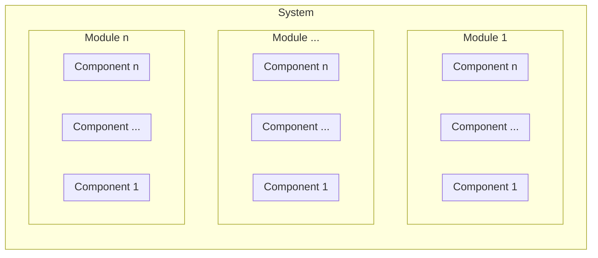

# Data Processing Framework (DPF)

DPF is a platform which provides a common way to process data from multiple Earth Observation (EO) missions. To be able to provide multi mission support, following points should be taken under consideration: 

- **Data Frequency and Load**: The data frequency of an EO mission depends on the orbit of the satellite(s) and the location of the ground station(s). Lets assume that there is one ground station located in mid latitudes. 
  - *GEO and MEO satellites*: the satellite is almost always visibly by the ground station and can provide data continuously. The load on the data processing system can be estimated and dynamic scalability mostly not needed. 
  - *LEO satellites*: the satellite visibility is limited and mostly it has 2 or 3 passes a day over the ground station each takes around 10-20 minutes. The satellite has to dump all its data during the pass and the data must be processed in a predefined time window (timeliness). In order to use computational resources efficiently, dynamic scalability of the system is important.  
  - *Reprocessing of the data*: for some cases, like validation of a new processing algorithm, calibration or quality assessment of products, reprocessing of data is needed. The processing system has to handle vast amount of data in short time. 
- **Variance of input data**: Mainly because of instrument differences, different missions produce different products. The processing system should be able to accept different input types, while providing a common experience to the user of the system.
- **Variance of data processing applications**: Some missions use a set of applications which are designed only for that mission. These applications are mostly static and HW/SW dependencies are not frequently changed. However some missions use Commercially available off-the-shelf (COTS) products. These applications are subject to regular updates and sometimes their HW/SW dependencies are changed.    

## Architectural Decisions

The architecture of the system is the mixture of following three architectural styles.

- Microservices
- Event-driven
- Big Data (HPC) 

Before explaining the Architectural Decisions, it is necessary to declare the decomposition levels of the system:



### Microservices Architecture

Components of the system shall be designed based on following  aspects of the Microservice architecture.

- Each component implements a single functionality
- Each component is loosely coupled and communication between components are provided by queues (asynchronous) and REST APIs (synchronous). 
- Each component can be developed and deployed without coordination.  

### Event-driven Architecture

Event-driven architecture has three main components, namely, event producers, event queue and event consumers. Event producers generate events and push them into the event queue. Event consumers listen the event queue and when an event is received, they process the event. Producers are decoupled from consumers and consumers are also decoupled from each other. In addition to the decoupling of the components, event driven architecture provides buffering of event and when needed enable scaling of the processing. 

Communication between modules and components is designed based on following principals: 

- Data flows in one direction. 
  - An event producer fires an event and doesn't wait any response.
  - Event consumers are unaware about event producers, each others and rest of the system. 
- An event consumer registers itself to an event type. When the expected event is fired, it consumes the event and produces another event to notify rest of the system. 
- Event queues are based on producer-consumer pattern, an event is processed only by a consumer.  

### Big Data Architecture

Big data solutions are based on following principals 

- Tasks must be finite and independent. A work can be split into tasks. They can run in parallel across many cores. 
- The system doesn't need to stay up all the time. In case of load, system can provision cores as needed to do work, and then release them.

The "Processing" module of the system is based on Big Data Architecture principals 
- Each processing application must be finite. This means, an application takes the input, processes it and produces an output. After the production is completed, it exits gracefully. 
- To be able to provide parallelism, there should be no dependency between processing applications. If there is a coupling between applications, they have to be bundled under same component. From the system level, they must be seen as a single component. 

## Design Decisions

### NoSQL Database
The input data must be catalogued in a common structure which can be queried by processing applications. For a single mission system, all data types are know and can be stored in a Relational DB system (RDBMS). However for a multi mission system, it is hard to create a common data structure that can support all missions. Adding a new mission to the system requires update on DB tables level. Also different missions have different criteria for querying data from the catalogue. 

A document-oriented NoSQL databases can solve these issues. In a Document-oriented NoSQL database, records are stored in documents which are encoded in a standard format like JSON or XML. Each mission can decide its own property set to define a data and query it as needed. During the ingestion phase, the properties of the data extracted as defined by the mission and stored in the catalogue. A mission doesn't need to know others data structure and can implement processing application independently from others. This also applicable for the common auxiliary data. For example TLE is commonly used data by almost all mission to estimate the satellites orbit. Each mission can create it own record in the catalogue. Ingestion module can create a record for each system while storing only one copy of the data in the Archive. 

### Process Orchestration

Process orchestration coordinates the processing applications to generate a product. For example, a BPMN compliant workflow engine can be used for the process orchestration. The advantages of the BPMN compliant workflow engine are:
- BPMN compliant process models are understandable by non-technical staff. 
- There are many commercial and open-source alternatives on the market. They are flexible to implement complex tasks. 
- It is easy to follow and debug the process chain.

These kind of workflow engines are designed to fullfil complex business tasks like mixture of automated and human tasks. However, for our use case, process chains are fairly simple. An output of a processing software is an input of one or more processing software. Sometimes it might be better to implement a custom but simple process orchestration module instead of using a COTS BPMN compliant workflow engine.

The advantages of a custom workflow engine are - it suits the business needs and it is more performant than a COTS product. However, because it is the core module of a data processing system, the design and development phases require more effort than other modules. Unfortunately this effort is mostly underestimated and causes many issues during the operational phase. 

DPF doesn't contain a process orchestration module. When a product is generated by DPF, it is ingested again in order to use in other processing applications. The advantages of this approach are:
- One less module to implement and maintain. This means, not only less implementation effort but also less configuration effort. 
- All intermediate and final products are stored in the catalogue and archive module. In case of a failure, no need to restart the processing from the beginning. This also helps the development or trouble shooting of the processing applications. 
- It supports of using same input data by more than one processing applications implicitly. 

### Centralized Monitoring

One of the challenges with an event-driven system is the monitoring of the production. What happens if a consumer gets the event from the queue and dies while processing it? Centralized Monitoring module collects all logs from the other modules and components. In case of an error occurred, centralized monitoring module can take action and re-trigger the event again.  

## Technologies used in the prototype

Following technologies are used during the development of the prototype

- **Java and Spring Boot**: are the programming language and framework to implement the modules of the system.  
- **Apache CouchDB**: is a document-oriented NoSQL database. CouchDB provides a REST API for inserting and searching records. It is used as the Catalogue module of this prototype. Another document-oriented NoSQL database could be also used instead of CouchDB but in this case, a REST API has to be implemented in order to integrate it to rest of the system.      
- **RabbitMQ**: is the  queue/communication layer between modules. 
- **The ELK Stack**: is used to capture, review and query logs generated by modules.
- **Docker**: is used to containerize the components and the processing applications. In a final system, Kubernetes would be a better option for the container management, but in this prototype, Docker's Java API is used for the container management.    

## System Design 

### Level 0

The DPF system is composed of following modules:
- Ingestion
- Catalogue & Archive 
- Processing
- Configuration
- Monitor & Control


### Level 1
#### Ingestion

The ingestion module converts the unstructured input data into a structured format that can be processed by processors.


- **File Reception**: watches the incoming folder and when a new file is received, pushes its filename to the *Ingestion Queue*. No workload is expected on this module. Thus one instance of this module is enough. 
- **Ingestor**: extracts a properties map from the incoming file and transfers the file and the extracted properties to the *Catalogue and Archive* module. Ingestor component parses the file name based on Ingestor configurations. It goes over the all configurations and instantiates one or more parsers when the configuration's pattern matches with the file name. After the file is successfully stored by the catalogue & archive module, it pushes the file name to the *Processing queue*. 
  - *Ingestor Configuration Repository*: keeps configuration files. A configuration file is a JSON file which is interpreted by the *Ingestor* module. A configuration file looks like as follows:
    ```json
    {
    "name" : "FileType01",
    "regex" : "(?<instrument>\\w+)_(?<satellite>\\w+)_(?<productionTime>\\d{8}_\\d{6})_(?<orbit>\\d{5}).(?<extension>\\w+)",
    "parser" : "FILENAME", 
    "fieldToValueConfMap" : {
      "orbit" : {
        "valueType" : "INTEGER"
      },
      "productionTime" : {
        "valueType" : "DATETIME",
        "format" : "yyyyMMdd_HHmmss"
      }
    }
    ```
    | Configuration Key | Description | 
    |--|--|
    | name | Descriptive name of the configuration. The value of this key is also used in the catalogue key |
    | regex | Regex of the file name. If the file name matches with this regex, Ingestor instantiates the configured parser |
    | parser | **FILENAME** : Filename parser <br> **METADATA** : Metadata Parser |
    | parser dependent configuration section| **Filename parser** : Defines the actual data type of the regex groups. If a group is not defined, String is used as default. <br> **Metadata parser** : The class name of the metadata parser. This class is instantiated during runtime with Java's Reflection API |

  - *Filename parser*: Uses the groups defined in the regex. it can also convert string values to numeric or date-time data types.
  - *Metadata parser*: Some files store their metadata in their header section, like GeoTIFF or in another file like a metadata XML. Depend on the input file format, custom metadata parsers can be implemented.  

#### Processing


- **Process Manager**
  - *Processor Definitions*
- **Processor Pool**
  - *Containers*
  - *HTC*
  - *Stream Processors*


## Open Points

- [ ] If the MQ goes down, all components fail. A fallback mechanism is needed when the MQ goes down .
  - https://stackoverflow.com/questions/58110868/fallback-mechanism-when-rabbitmq-goes-down 