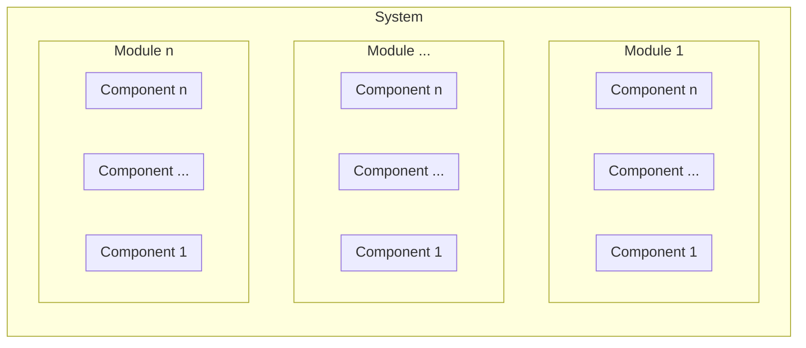

# Data Processing Framework (DPF)

DPF is a platform which provides a common way to process data from multiple Earth Observation (EO) missions. To be able to provide multi mission support, following points should be taken under consideration: 

- **Data Frequency and Load**: The data frequency of an EO mission is the depends on the orbit of the satellite(s) and the location of the ground station(s). Lets assume that there is one ground station located in mid latitudes. 
  - *GEO and MEO satellites*: the satellite is almost always visibly by the ground station and can provide data continuously. The load on data processing system can be estimated and dynamic scalability mostly not needed. 
  - *LEO satellites*: the satellite visibility is limited and mostly it has 2 or 3 passes over the ground station each takes around 10-20 minutes. The satellite has to dump all its data during the pass and the data must be processed in a predefined time window (timeliness). In order to use computational resources efficiently, dynamic scalability of the system is important.  
  - *Reprocessing of the data*: for some cases, like validation of a new processing algorithm, calibration or quality assessment of products, reprocessing of data is needed. The processing system has to handle vast amount of data in short time. 
- **Variance of input data**: Mainly because of instrument differences, different missions produce different products. The processing system should be able to accept different input types, while providing a common experience to the user of the system.
- **Variance of data processing applications**: Some missions use a set of applications which are designed only for that mission. These applications are mostly static and HW/SW dependencies are not frequently changed. However some missions use Commercially available off-the-shelf (COTS) products. These applications are subject to regular updates and sometimes their HW/SW dependencies are changed.    

## System Requirements

- **Scalability**: 
- ****

## Architectural Decisions

The architecture of the system is the mixture of following three architectural styles.

- Big Data (HPC) 
- Event-driven
- Microservices

Before explaining the Architectural Decisions, it is necessary to declare the decomposition levels of the system:

### Microservices Architecture

Components of the system shall be designed based on following  aspects of the Microservice architecture.

Each component ...
- ... implements a single functionality
- ... is loosely coupled and communication between components are provided by queues (asynchronous) and REST APIs (synchronous). 
- ... can be developed and deployed without coordination.  

### Event-driven Architecture

Event-driven architecture has three main components, namely, event producers, event queue and event consumers. Event producers generates events and push them into the event queue. Event consumers listen the event queue and when an event is received, they process the event. Producers are decoupled from consumers and consumers are also decoupled from each other. In addition to the decoupling of the components, event driven architecture provides buffering of event and when needed enable scaling of the processing. 

Communication between modules and components is designed based on following principals: 

- Data flows in one direction. 
  - Event producers fire an event and don't wait any response.
  - Event consumers are unaware about event producers, each others and rest of the system. 
- An event consumer registers itself to an event type. When the expected event is fired, it consumes the event and produces another event to notify rest of the system. 
- Event queues work based on producer-consumer pattern, an event is processed only by a consumer.  

### Big Data Architecture

Big data solutions provides following benefits 

- **Parallel computing**: To process large data sets quickly, big data architectures use parallel computing.
- **Elastic scalability**: Big Data architectures can be scaled horizontally. 

Management of the processing applications is based on Big Data Architecture principals 
- Each processing application must be finite. This means, an application takes the input, processes it and produces the output. After the production is completed, it exits gracefully. 
- To be able to provide parallelism, there should be no dependency between processing applications. If there is a coupling between applications, they have to be bundled under same component. From system level they must be seen as a single component. 

## Design Decisions

### Centralized Monitoring

### NoSQL Database

The structured data is catalogued in either a relational database or in a NoSQL database. 

### Orchestration
The cadence of Big Data analysis involves multiple data processing operations followed by data transformation, movement among sources and sinks, and loading of the prepared data into an analytical data store. These workflows can be automated with orchestration systems from Apache such as Oozie and Sqoop, or Azure Data Factory.

## Technologies used

- Spring Boot: the base for the components
- RabbitMQ: the queue/communication layer our services will talk;
- The ELK Stack: to capture, review and query logs generated by components.
- Docker:

## System Design 

**Legend**
| Shape       | Desciption |
|-------------|------------|
| Solid  line | Event flow |
| Dotted line | File  flow |

### Level 0

#### Ingestion

The ingestion layer converts the unstructured input data into a structured format that can be processed by processors. The structured data is catalogued in either a relational database or in a NoSQL database. A specialized distributed system is a good option for high-volume batch processed data in various formats.

### Level 1
### Ingestion

##### Metadata extraction

Sample Scenario configuration

<instrument>_<satellite>_<station>_<creatation>_<product>_<level>_<extension1>.<extension2>

<instrument>_<creationday>_<creationtime>_<satellite>_<orbit>_<station>_<level>

<instrument>_<product_type>_<satellite>_<sensing_start>_<sensing_end>_<processing_time>_<orbit>_<station>_<level>.<extension>

INSTNAME_PRODUCTTYPE_SAT_SENSINGSTART_SENSINGEND_MODE_PRO
CTIME.bz2 

INSTNAME_YYYYMMDD_HHMI_SAT_ORBIT_STATION

FDR_L1C_HIRS3_NOAA15_20050908131002_20050908145109_R01.0.nc
AVHR_GAC_1B_N19_20170613222203Z_20170613222503Z_N_O_20170613234201Z.bz2
avhrr_20170510_005800_noaa19.hrp.bz2

AVHR_HRP_00_M01_20211019094900Z_20211019095000Z_N_O_20211019095106Z.bz2
hirs_20130318_1008_metopb_2581_mas.l1d.bz2\
W_XX-EUMETSAT-mon,amsua,DBNet+noaa19+mon_C_EUMS_20170730234611_amsua_20170730_2200_noaa19_43683_mon_l1c_bufr.bin

- Satellite 01
  - Instrument 01
  - Product level

###### From the file name

###### From the additional metadata file

## Open Points

- [ ] If the MQ goes down, all components fail. A fallback mechanism is needed when the MQ goes down .
  - https://stackoverflow.com/questions/58110868/fallback-mechanism-when-rabbitmq-goes-down 