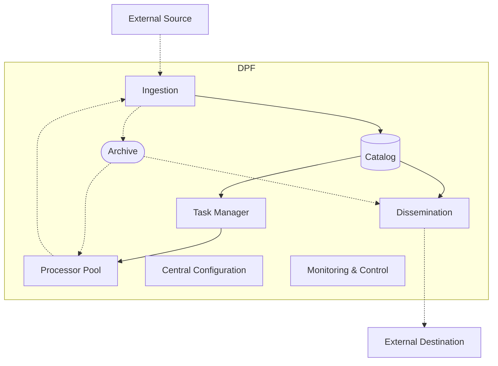
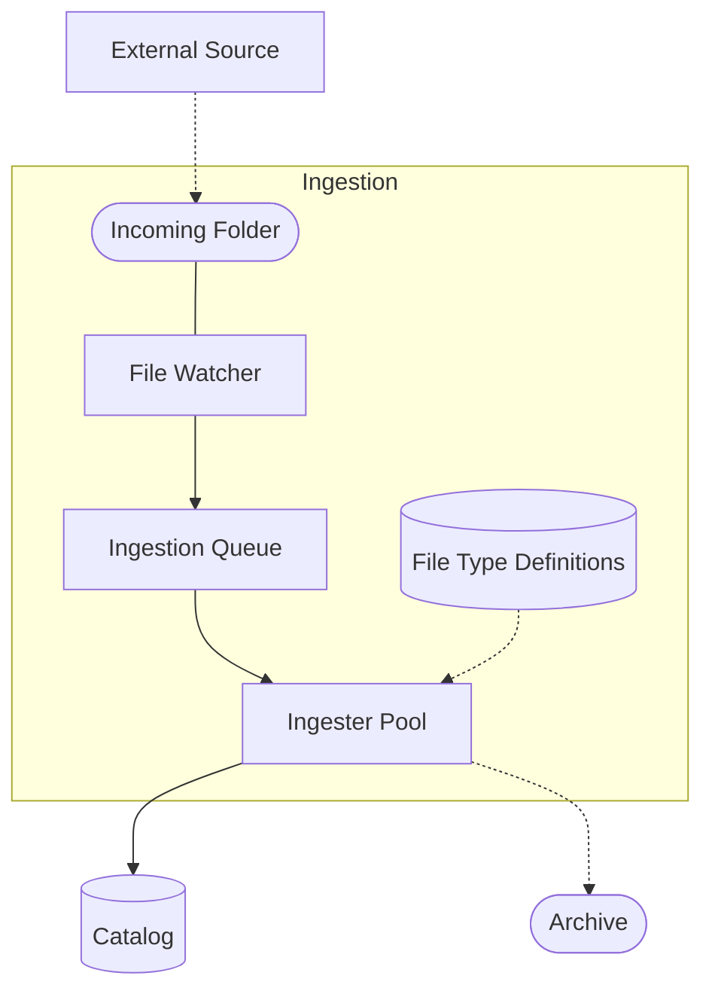

# Data Processing Framework

## Scope

## System Requirments

### Functional


### Non Functional

- **SYS-NF-Scalibility-0010**: 
- **SYS-NF-Testibility-0010**: Each component of the system shall be able to indepently testable  
- **SYS-NF-Maintainability-0010**: 
## Architectural Decisions

### Event-driven architecture

- Data flows in one direction. 
- Event producers fire an event and don't wait any response.
- Event consumers are unaware about event producers and rest of the system. 
- An event consumer registers itself to an event type. When the expected event is fired, it consumes the event and produces another event to notify rest of the system. 
- event queues work based on producer-consumer pattern 

```mermaid


```

### Microservices

- All components of the  

### Centralized Monitoring


## System Design 

**Legend**
| Shape       | Desciption |
|-------------|------------|
| Solid  line | Event flow |
| Dotted line | File  flow |

### Level 0



### Level 1
### Ingestion
